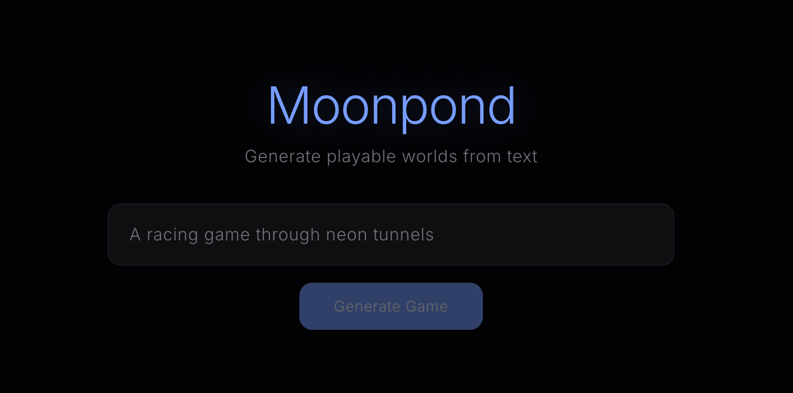

# moonpond



AI-powered Godot game generator. Describe a game in natural language, and Moonpond generates a playable browser game using Godot 4 + WebAssembly. Supports both 2D and 3D games with AI-generated visual assets (sprites, 3D models).

## Running the Backend Locally

### Prerequisites

- Python 3.12+ and [uv](https://docs.astral.sh/uv/)
- Godot 4.5.1 (for WASM export)
- A `.env` file in the project root with your API keys:
  ```
  ANTHROPIC_API_KEY=...          # Required — all LLM calls
  OPENAI_API_KEY=...             # Recommended — 2D sprite generation (OpenAI gpt-image-1)
  TRIPO_API_KEY=...              # Recommended — 3D model generation (Tripo API)
  ```

### Start

```bash
cd backend
uv sync
uv run uvicorn backend.main:app --reload --port 8000
```

The API server runs at `http://localhost:8000`.

## Running the Frontend

### Prerequisites

- Node.js 18+ and npm

### Start

```bash
cd frontend
npm install
npm run dev
```

The dev server runs at `http://localhost:3001`. It connects to the backend at `http://localhost:8000`.

## Running the Backend with Docker

### Prerequisites

- [Docker](https://www.docker.com/products/docker-desktop/) installed and running
- A `.env` file in the project root with your API keys (see above)

### Build

```bash
docker build -t moonpond-backend .
```

This downloads Godot 4.5.1-stable (Linux) and export templates (~1.4 GB) into the image, verifies checksums and version, then installs the Python backend. The first build takes a while (minutes) due to the template download; subsequent builds use Docker layer caching.

### Run

```bash
docker compose up
```

The backend starts at `http://localhost:8000`. Generated games are persisted to the `games/` directory on your host via a volume mount.

### Verify

```bash
# Check Godot is installed correctly inside the container
docker compose exec backend godot --headless --version
# Should print: 4.5.1.stable...

# Check the backend is responding
curl http://localhost:8000/docs
```

### Rebuild

If you change backend code, rebuild and restart:

```bash
docker compose up --build
```

## Tests

```bash
# Backend
cd backend
uv run pytest

# Frontend
cd frontend
npm test
```
